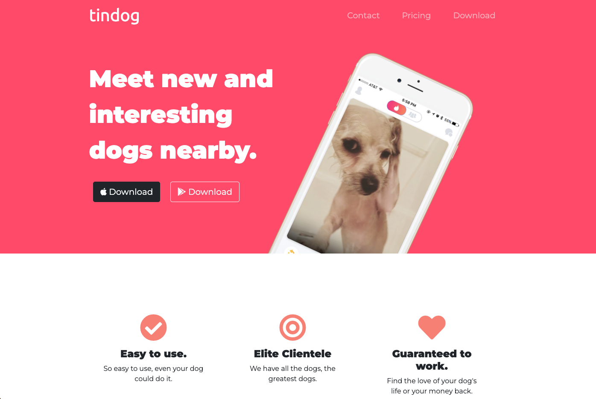

# Tin Dog Project

## Description:
Heard of Tinder? Now there is Tin Dog! Your pup no longer has to go about their day lonely. Help your companion find a companion today!

## What I Learned:

1. This my first experience working with Bootstrap and Font Awesome. Both Bootstrap and Font Awesome are great resources for gathering snippets of code to help create a beautiful website. 

2. Learned how to utilize Bootstrap Grid, Bootstrap Containers, Bootstrap Carousel's, and Bootstrap Cards.

3. Worked again with Multiple Selectors, Hierarchical Selectors, and Combined Selectors.

4. Improved my knowledge in refactoring code and implementing Don't Repeat Yourself (DRY) Code.

5. Incorporated Google Fonts into my code with font's Montserrat and Ubuntu.

6. Touched base with CSS Z-Index and Selector Priorities.

7. Lastly made a very responsive webpage 🙂

Visit the TinDog Webpage today! https://coderortiz.github.io/tin_dog_project/